<h1 align="center">opusfleet</h1>

<p align="center">
  <b>A Kafka-backed ingest pipeline for Opus audio from device fleets — and a simulator that puts 500+ devices on the wire.</b>
</p>

<p align="center">
  
  
  
  
  
</p>

<p align="center">
  
</p>

---

## What this is

Embedded devices that stream audio — body-worn recorders, stage microphones, IoT sensors — usually land on a server that does everything on the socket thread: parse, decode, meter, segment, upload. That design has two failure modes. A slow object-store `PUT` applies backpressure all the way back to the microphone, and you cannot add a consumer (transcription, alerting, analytics) without editing the hot path.

**opusfleet** splits that apart along Kafka, and ships a load generator honest enough to prove it works.

- **Ingest never decodes.** It parses the framing and produces. Decoding costs about a full CPU core at 500 devices, so it lives in consumers that can be scaled or restarted without dropping a socket.
- **Segments are re-muxed, not re-encoded.** The device already produced Opus; the segmenter wraps those exact packets in an Ogg container. Output is bit-identical to what the microphone captured, at **1/12th** the size of 48 kHz WAV.
- **The simulator speaks the real wire format.** Same framing, same RTP headers, same encoder settings. The server cannot tell it from hardware — which is the only way a load test means anything.

## Quick start

```bash
git clone https://github.com/dhritiman-dasgupta/opusfleet.git
cd opusfleet

docker compose up -d --build              # Kafka + MinIO + five services
docker compose --profile load up fleet    # 500 simulated devices

docker compose logs -f segmenter          # watch segments land
curl -s localhost:8080/api/devices | head
open http://localhost:9001                # MinIO console (opusfleet / opusfleet-dev-secret)
```

| Port | Service |
|---|---|
| `6000` | device ingest (TCP) |
| `8080` | REST API |
| `8081` | live audio (WebSocket) |
| `9001` | MinIO console |
| `29092` | Kafka, for CLI tools |

### Without Docker

```bash
python3 -m venv .venv && .venv/bin/pip install -r requirements.txt
sim/make_samples.sh                                    # synthesise test audio

.venv/bin/python -m server.run sink                    # reference receiver, no Kafka needed
.venv/bin/python sim/sim_device.py sim/samples/tone-1k.wav --imei 860000000000001
.venv/bin/python sim/fleet.py -n 500 --host 127.0.0.1
```

`sink` is a protocol-correct receiver whose only dependencies are `opuslib` and `numpy`. It reports frames, kbps, dBFS and **RTP sequence loss** per device — useful as a baseline to diff the Kafka pipeline against, and for testing the simulator with nothing else running.

## The wire protocol

Length-prefixed frames over TCP. [`server/protocol.py`](server/protocol.py) is the single definition that both the simulator and the server import, so they cannot drift apart.

```
[2-byte big-endian length][payload]

payload = "HELLO:<device-id>"     first frame; registers the device
        | "STAT:{json}"           telemetry: signal strength, operator, serving cells
        | <12-byte RTP header + Opus packet>
```

Audio is **48 kHz mono Opus, 20 ms per frame, 64 kbps**, complexity 3, inband FEC on. The RTP header is `0x80 | PT 111 | seq | timestamp (+960/frame) | SSRC`.

Keeping the RTP header in the Kafka payload is deliberate: sequence numbers survive into every consumer, so **loss is measurable downstream** instead of only at the socket.

## Storage

Opus in an Ogg container, not WAV. The segmenter never decodes.

| Format | Per device | 500 devices / 24 h |
|---|---|---|
| WAV, 48 kHz mono s16 | 345 MB/h | ~414 GB |
| **Ogg Opus, 64 kbps** | **28 MB/h** | **~35 GB** |

Keys are `<device-id>/<YYYY-MM-DD>/<HHMMSS>_<duration>s.opus`, served as presigned URLs. Set `SEGMENT_FORMAT=wav` if you need the decoded form.

Storage is any S3-compatible endpoint — MinIO locally, Amazon S3 by pointing `S3_ENDPOINT` at `s3.<region>.amazonaws.com` with `S3_SECURE=1`.

## Measured

500 simulated devices against the compose stack (4 vCPU / 8 GB VM), fleet generated on the host:

| | |
|---|---|
| Fleet output | **25,000 frames/s** sustained (500 × 50), 0 dropped, 0 reconnects |
| Ingest | 500 online, 24,868 fps, 25.9 Mbps, **0 frames dropped**, producer queue peak 1,671 / 1,000,000 |
| `segmenter` lag | **0** |
| `live` lag | **0** |
| `levels` lag, 1 replica | grew to **1,064,256** — could not keep up |
| `levels` lag, 4 replicas | drained 756,535 → **0**, peaking at 25,497 msg/s |

Ingest and the non-decoding consumers handle 500 devices comfortably. **Only the decode stage needs scaling** — which is exactly why it was kept off the ingest path:

```bash
docker compose up -d --scale levels=5     # no device reconnects
```

**Rule of thumb: one `levels` replica per 100 devices.** `audio.raw` has 12 partitions, so a consumer group scales to 12 before partition count becomes the ceiling.

```bash
docker compose exec kafka /opt/kafka/bin/kafka-consumer-groups.sh \
  --bootstrap-server localhost:9092 --describe --all-groups
```

## Failure injection

A load test that only exercises the happy path is decoration. The simulator reproduces what real hardware does when the network misbehaves:

| Flag | Reproduces |
|---|---|
| `--loss P` | ring-buffer tail-drop when the device's send buffer is full |
| `--stall S --stall-every N` | a cellular outage: frames pile into the device's store-and-forward buffer, then burst |
| `--drop-hello` | identity frame lost — the stream lands under `unknown` rather than being discarded |
| `--bitrate` | an encoder configured differently from the fleet |

The stall path is the one most likely to break a server, because the backlog arrives far faster than real time. Verified: a 4 s outage buffers exactly 200 frames (4 s × 50 fps) and replays them with **zero loss**.

## Layout

```
server/
  protocol.py     wire format — the single source of truth
  opus_ctl.py     libopus CTL calls that work on arm64 (see Notes)
  oggopus.py      Ogg Opus muxer, RFC 7845
  ingest.py       TCP :6000 -> Kafka. Parses and produces, nothing else
  segmenter.py    audio.raw -> Ogg Opus segments -> object storage
  levels.py       audio.raw -> per-second dBFS -> device.levels
  live.py         audio.raw -> WebSocket, decoding only what is being watched
  api.py          REST, rebuilding device state from the topics
  sink.py         dependency-light reference receiver
sim/
  sim_device.py   one device, with failure injection
  fleet.py        hundreds of devices across processes
deploy/           single-VPS overlay: Caddy TLS, loopback-bound broker
```

One image, six roles — the entrypoint selects which process runs, so every service shares a layer cache and none can drift to a different `protocol.py`.

## Notes

Three things worth knowing, found while building this:

- **`opuslib`'s encoder setters silently fail on arm64.** It calls the variadic `opus_encoder_ctl` through ctypes without declaring `argtypes`, so libffi uses the fixed-argument convention. On arm64 variadic arguments travel on the stack while fixed ones travel in registers, and every request returns `OPUS_BAD_ARG`. [`server/opus_ctl.py`](server/opus_ctl.py) declares argtypes for the *fixed* portion only and passes the value as an extra — pinning a full three-argument prototype does **not** work. This affects Apple Silicon and arm64 Linux containers alike.
- **`audioop` was removed in Python 3.13.** Any audio server importing it for `rms`/`max` stops starting on a modern interpreter. Use numpy.
- **Ingest is unauthenticated.** Anything that connects and sends `HELLO:<id>` *is* that device. That is what makes the simulator possible, and it means anyone who can reach port 6000 can impersonate a device or poison its recordings. Put it behind a private network, or add a shared secret to the HELLO frame, before exposing it.

## License

MIT — see [LICENSE](LICENSE).
